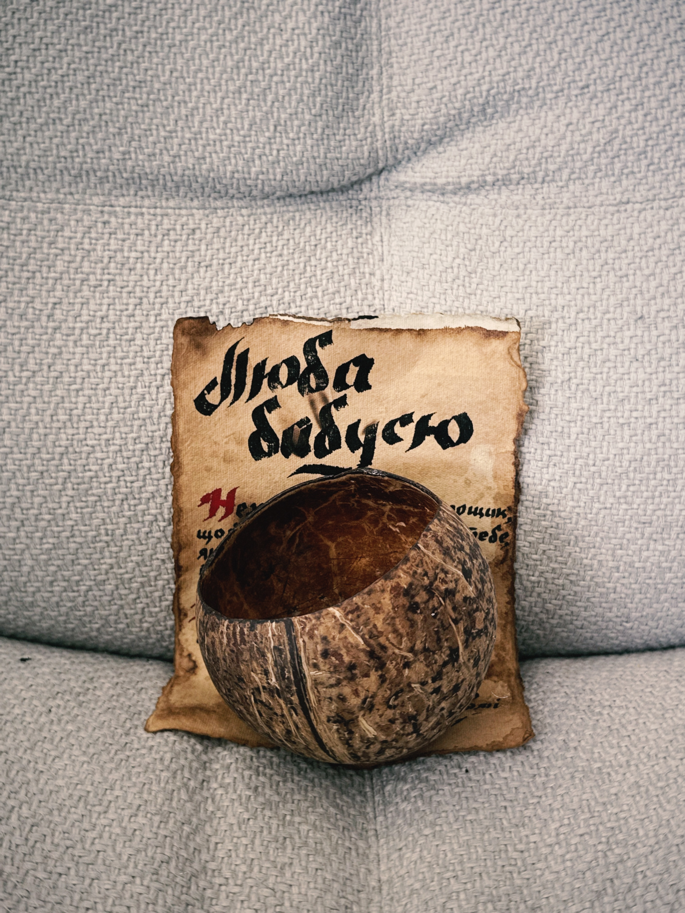

# Горщик з кокосу для бабулі

Той самий кокос, з якого взагалі почалась ідея робити горщики для когось. Знайшла його Дашка, коли ми з кавʼярні йшли до українського магазину за пельменями і варениками. Мʼякоть ми зʼїли, я навіть по-моєму пив воду кокосову з нього і було досить смачно.

## Листівка

Теж все руцями на гарному пепері, який був зістарений і покоцаний шоб мати отакий прикольний вигляд.
