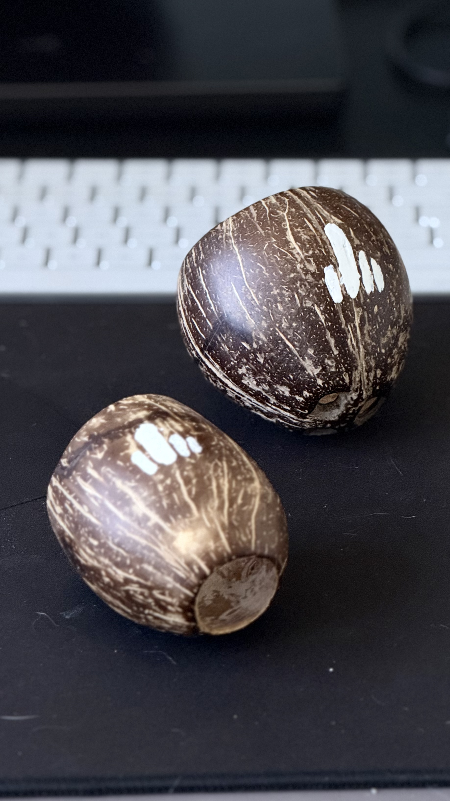
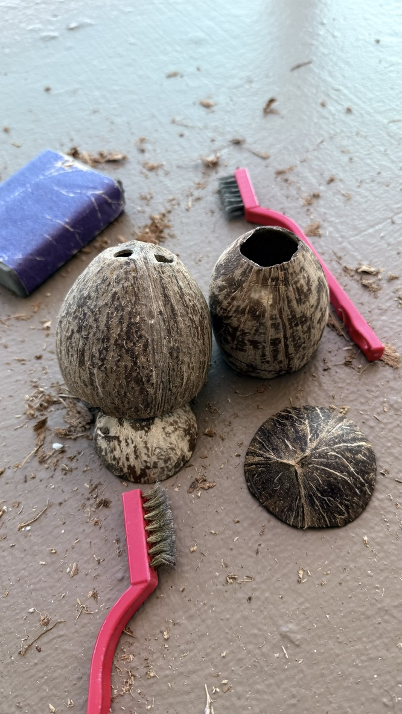
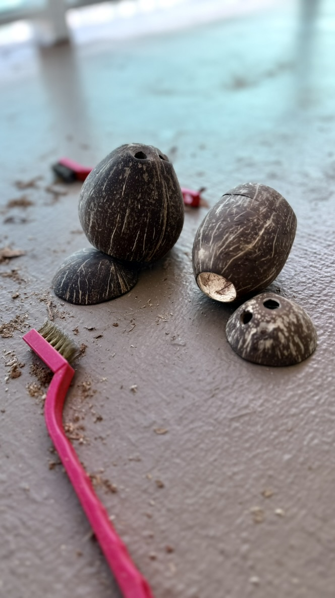
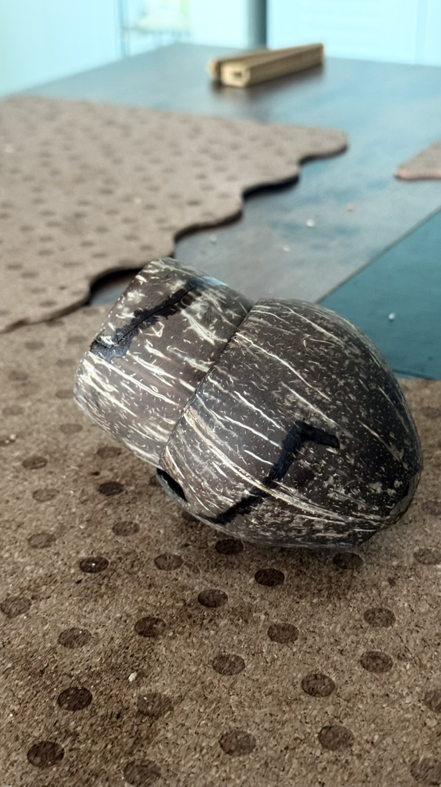
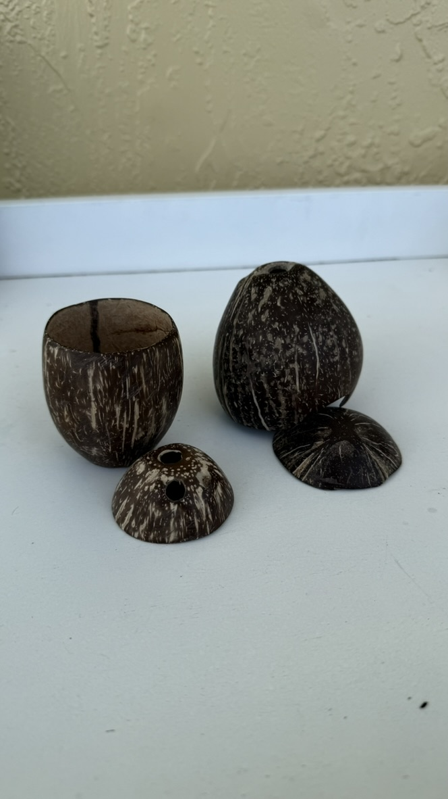
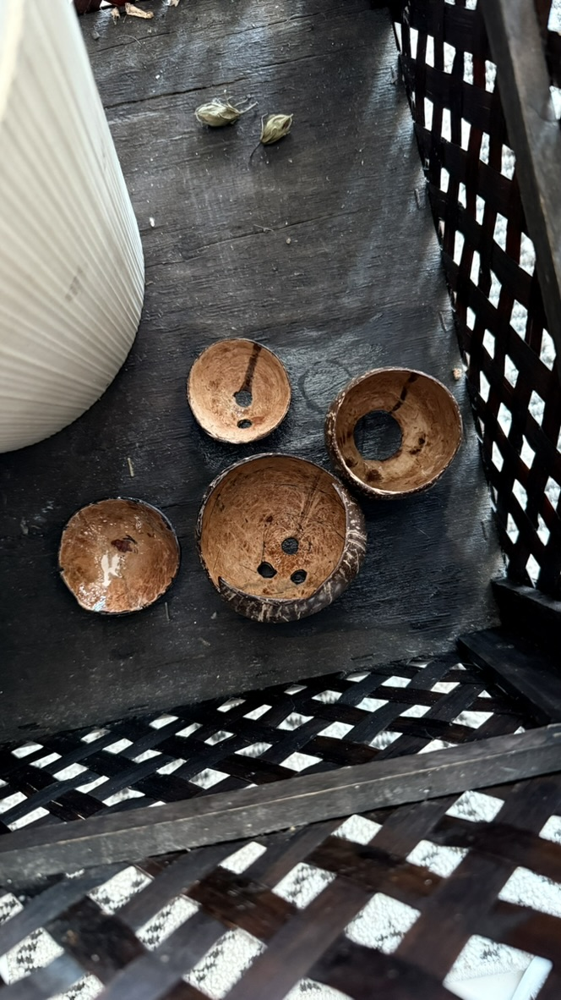
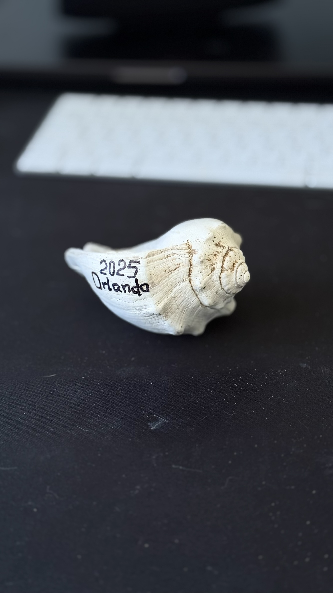

# Горщик з кокосу для Тьоми

Як і попередні горщики - все зроблено виключно руками, зі знайдених десь посеред Hollywood (Florida) на вулиці кокосів.

Головна відмінність тут - є декілька фотографій прогресу. Почав їх робити ще на квартирі в Suny Isles Beach, а закінчив вже на наступній квартирі у Hollywood FL.

Коли діставав ці кокоси з їх лушпиння, трошки невдало натиснув десь і зʼявились тріщини. Саме тріщини і визначили для кого будуть зроблені горщики. Бо наша дружба з Тьомою колись теж давала тріщину, і не одну, але ми їх успішно залатали, що безмежно приємно усвідомлювати.

# Крок 1 - зняття ворсу

Зняти весь ворс, який заважаиме при шліфуванні це чи не найважча частина. Точно потребує терпіння і трошки сили в руках, як не дивно))

Не сказати шоб щітки були супер ефективними в цьому процесі, але нічого кращого за них я покищо не придумав. Бо завжди залишається до десятка волокон, які вилазять на наступних етапах.

# Крок 2 - шліфування

На цьому етапі все просто. Спочатку 80 або 100 наждачка, потім 200, 400, 800 і 100 або 1200. В результаті маємо приємну на дотик поверхню, без стирчащих волокон. По звуку та відчуттям починає навіть потроху якийсь пластик нагадувати.

Трохи був не впевнений шо робити з тріщинами на цьому етапі. бо з одної сторони хочецця ж шоб гладенка поверхня була, а з іншої - нашо шліфувати, кшо клеєм все заллю. Вирішив шліфувати енівей, бо впадлу було заморачуватись оце обходити тріщини. Шарашив наждаком всюди та і паділом!

# Крок 3 - заклеювання тріщин

Не зклеїти собі пальці було неможливо. Я ще додумався не підстілити нічого з одної сторони "шву" шоб не мати потім справу з іще більшою кулькістю шліфування. Ну...шліфував потім пальці шоб хоч якось позбутись того суперклею.

Та, зклеювалось все на звичайнісінький суперклей. Ніяких там епоксидок чи інших заморочок. Епоксидка буде потім, про це окремо.

# Крок 4 - покриття маслом

Не певен шо ця фотографія саме після покриття маслом, але іншого пояснення чо воно так потемніло я не знаходжу))) Може бути, що це було ще одне коло шліфування, або і шліфування і маслом покриття...але пофіг. Текстовка буде про покриття маслом.

Начить покриваю маслом я слоїв в 3-4 звзвичай, там як по настрою буде вже. Все виключно "на око" і виключно орієнтуючись на власне якесь 3-тє око, язх як це обізвати.

# Крок 5 - покриття епоксидкою

Так як витвір цей задумувався як горщик, то внутрішня поверхня мала б бути водостійкою і тому я нічо краще не придумав чим покрити його епоксидкою в один шар. Вроді має працювати. Сам маю два горщика які так були зроблені - всьо росте, всьо працує, нарікань нема.

Епоксидка простєйша, куплена в Home Depot, двухкомпонентна. Міксую все так само "на око" шоб приблизно 1 до 1 виходило. Піницця, падлюка, тіки... але на внутрішній поверхні воно і не помітно і в цілому похуй.

Сохне ця вся бадяга десь добу. Боже бути довше, якшо наквєцати забагато, як я це зробив з "логотипами" наприкінці. Логотипи висихали днів два.

# Мушля

Знайдена була товаришем в Kelly Park, Orlando, Florida по дорозі на річку. От прям в піску на дорозі лежала. Та ще і не одна така була, а з десяток штук.

Ну, ото я собі і забрав. Подумав шо може начищу її якось красіво чи лаком вскрию чи шо.

А по факту вийшло шо я просто написав рік і тіпа місце де знайдена була і тіки частину з написом та NFC тегом покрив епоксидкою шоби довговічніше вийшло.
